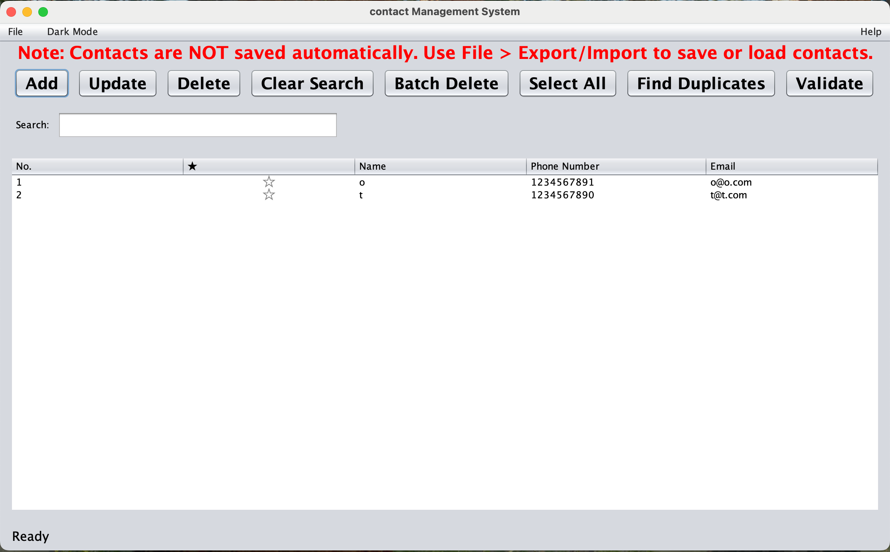
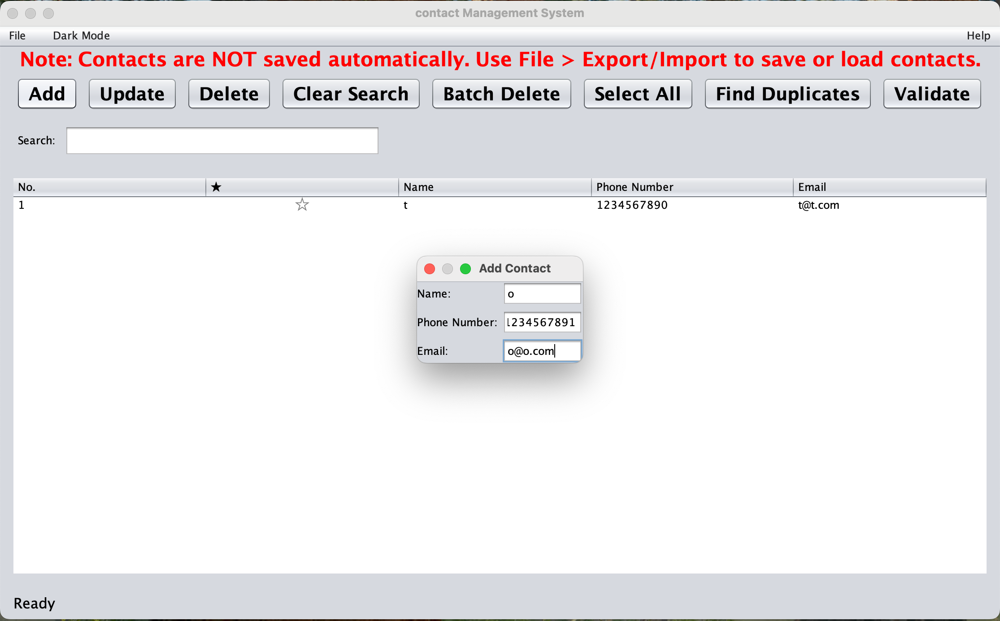
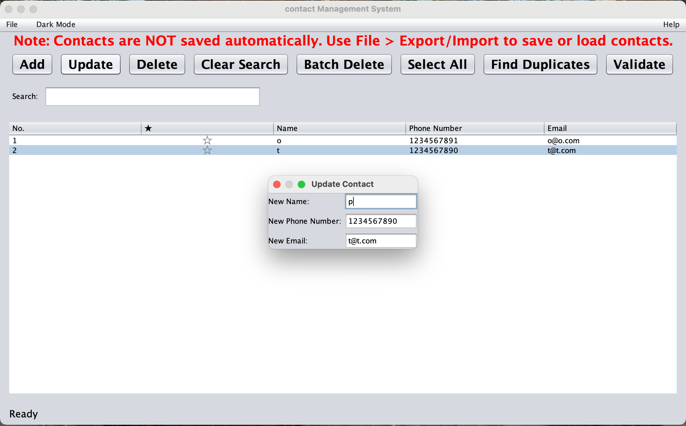
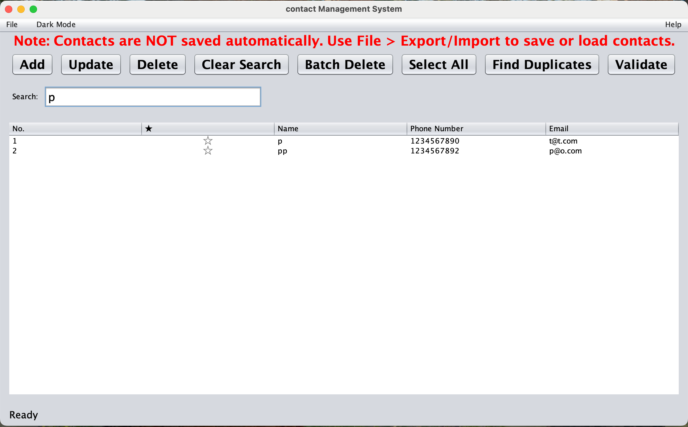
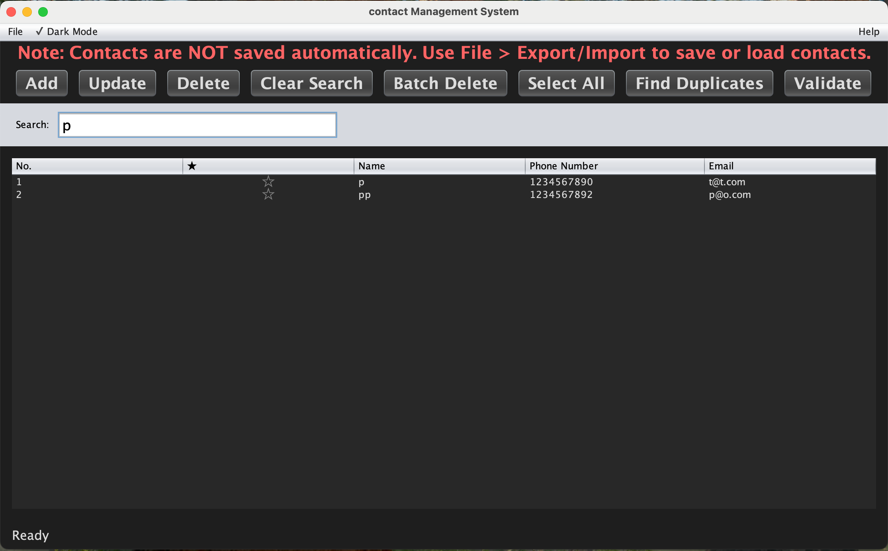
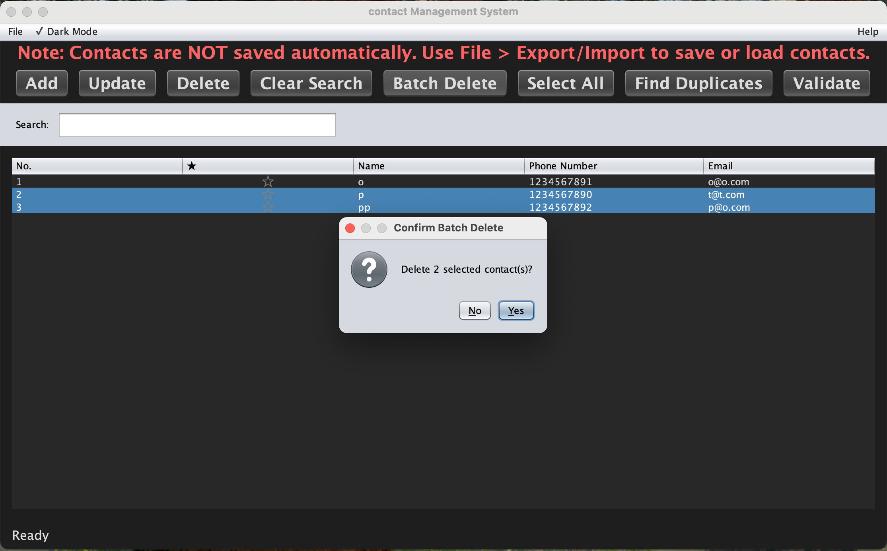
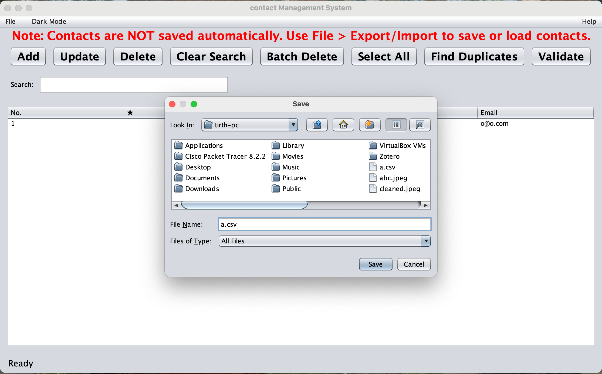
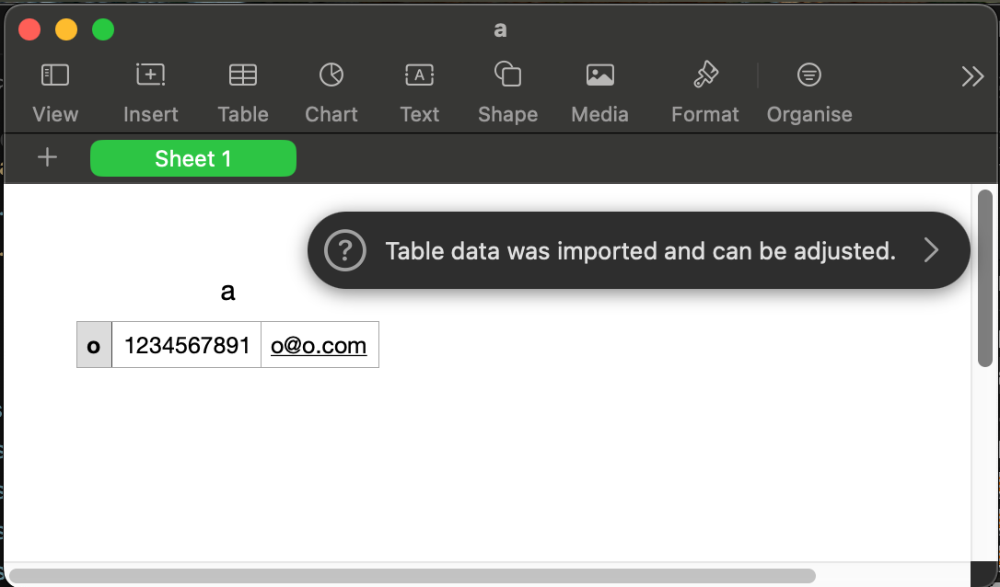
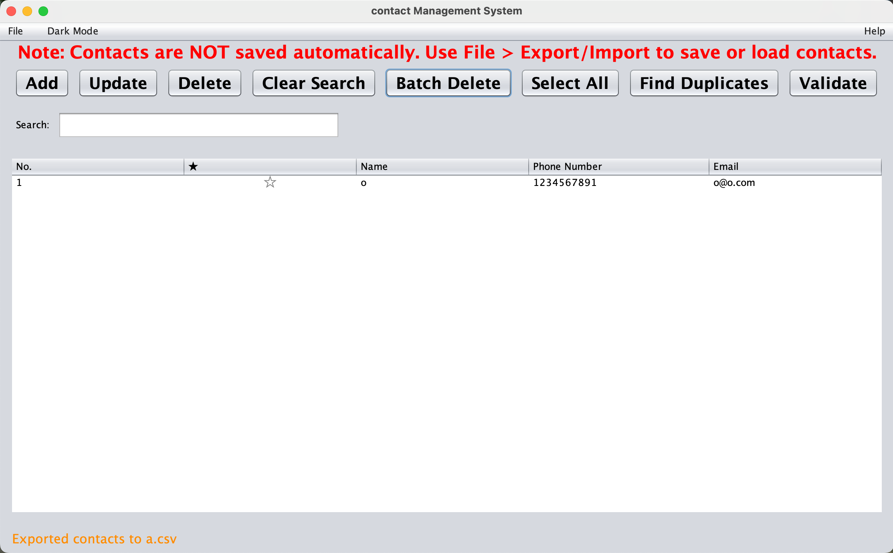
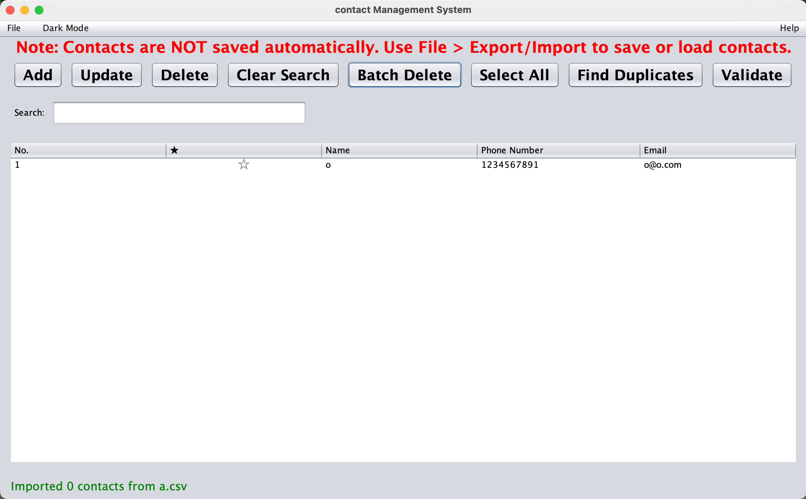

# Contact Management System

A modern Java Swing-based contact manager using an AVL tree for fast operations.

## Features

- **Core Contact Management**: Add, update, and delete contacts with validation
- **Favorites System**: Mark contacts as favorites with star icons (★/☆)
- **Batch Operations**: Select multiple contacts and delete them at once
- **Live Search**: Real-time filtering by name, phone number, or email (press Enter)
- **Import/Export**: CSV file support for data portability
- **Dark Mode**: Toggle between light and dark themes
- **Accessibility**: Full keyboard navigation and screen reader support
- **Responsive UI**: Modern interface that adapts to window resizing
- **Contact Duplicate Detection**: Find and merge duplicate contacts automatically
- **Contact Validation**: Validate email/phone formats and identify invalid contacts
- **Performance Optimized**: Cached operations and efficient algorithms
- **Cross-Platform**: Works seamlessly on Windows, macOS, and Linux

## Screenshots

### Main Application Window


*The main contact management interface with modern UI*

### Add Contact Dialog


*Dialog for adding new contacts with validation*

### Update Contact Dialog


*Dialog for updating existing contact information*

### Search Functionality


*Live search filtering contacts in real-time*

### Dark Mode


*Application in dark mode for better visibility*

### Batch Delete


*Multi-select and batch delete functionality*

### Import/Export





*File import and export dialogs*

## How to Run

### Quick Start (Development)

1. **Compile:**

   ```sh
   javac *.java
   ```

2. **Run:**

   ```sh
   java Main
   ```

### Distributable Packages

Ready-to-use packages are available in the `distributable/` folder:

#### 📦 **Available Packages**

- **🍎 macOS**: `Telephone Book-1.0.0.dmg` - Double-click to install
- **📦 Portable**: `TelephoneBook.jar` - Run with `java -jar TelephoneBook.jar`

#### 🚀 **Creating Packages for Other Platforms**

**For Windows packages (EXE, MSI):**

```cmd
# On Windows with JDK 14+
cd distributable
build-windows.bat
```

**For Linux packages (DEB, RPM):**

```bash
# On Linux with JDK 14+
cd distributable
./build-linux.sh
```

#### 📋 **Package Features**

- ✅ **No Java Required**: All packages include bundled Java runtime
- ✅ **Native Installers**: Platform-specific installation experience
- ✅ **System Integration**: Appears in system menus and creates shortcuts
- ✅ **Uninstall Support**: Proper removal through system tools

## Features in Detail

### Contact Management

- **Add Contacts**: Click "Add" button or use Ctrl+N shortcut
- **Update Contacts**: Select a contact and click "Update" button
- **Delete Contacts**: Select a contact and click "Delete" button or press Delete key
- **Batch Delete**: Select multiple contacts and click "Batch Delete"
- **Find Duplicates**: Click "Find Duplicates" to detect and merge duplicate contacts
- **Validate Contacts**: Click "Validate" to check for invalid email/phone formats
- **Favorites**: Click the star column to toggle favorite status

### Search and Filter

- **Live Search**: Type in the search field and press Enter to filter by name, phone, or email
- **Clear Search**: Click "Clear Search" to show all contacts and clear cache
- **Favorites**: Click the star (★/☆) column to mark/unmark favorites
- **Real-time Filtering**: Instant results as you type

### File Operations

- **Import**: File > Import Contacts to load from CSV (with validation)
- **Export**: File > Export Contacts to save to CSV
- **Auto-save**: Contacts are kept in memory only - use Export to save
- **Data Validation**: Invalid contacts are filtered during import

### User Interface

- **Dark Mode**: Toggle in the menu bar or use keyboard shortcut
- **Responsive Layout**: Buttons wrap to new lines when window is resized
- **Modern Design**: Clean, professional interface with consistent styling
- **Keyboard Shortcuts**:
  - **Ctrl/Cmd+N**: Add contact
  - **Ctrl/Cmd+E**: Update selected contact
  - **Delete**: Delete selected contact
  - **Ctrl/Cmd+Shift+D**: Batch delete selected contacts
  - **Ctrl/Cmd+F**: Focus search field
  - **Ctrl/Cmd+L**: Clear search
  - **Ctrl/Cmd+A**: Select all contacts
  - **Ctrl/Cmd+I**: Import contacts
  - **Ctrl/Cmd+S**: Export contacts
  - **Ctrl/Cmd+T**: Toggle dark mode
  - **F1**: Show help/about dialog
  - **Enter**: Submit dialogs
- **Accessibility**: Full keyboard navigation and screen reader support

## Project Structure

```sh
telephone_book/
├── Main.java                              # Main application and GUI
├── Contact.java                           # Contact data model
├── AVLNode.java                           # AVL tree node
├── AVLTree.java                           # AVL tree implementation
├── CSVReader.java                         # CSV file operations
├── README.md                              # This file
├── LICENSE                                # MIT License
├── .gitignore                             # Git ignore rules
├── screenshots/                           # Application screenshots
├── distributable/                         # Ready-to-use packages
│   ├── Telephone Book-1.0.0.dmg          # macOS installer
│   ├── TelephoneBook.jar                  # Portable JAR
│   ├── build-windows.bat                  # Windows build script
│   ├── build-linux.sh                     # Linux build script
│   └── README.txt                         # Package instructions
```

## Technical Details

- **Language**: Java 8+
- **GUI Framework**: Java Swing with Nimbus Look & Feel
- **Data Structure**: AVL Tree for efficient operations (O(log n) complexity)
- **File Format**: CSV for import/export with validation
- **Architecture**: MVC pattern with separated concerns
- **Performance**: Regex caching, optimized algorithms, memory management
- **Cross-Platform**: Works on Windows, macOS, and Linux
- **Memory Management**: Automatic resource cleanup and cache management

## Cross-Platform Compatibility

This application is designed to work seamlessly across all major operating systems:

### ✅ **Windows**

- **Java**: Java 8 or higher required
- **Multi-selection**: `Ctrl+Click` for individual contacts
- **Keyboard shortcuts**:
  - `Ctrl+N` - Add contact
  - `Ctrl+E` - Update contact
  - `Delete` - Delete selected contact
  - `Ctrl+Shift+D` - Batch delete
  - `Ctrl+F` - Focus search
  - `Ctrl+L` - Clear search
  - `Ctrl+A` - Select all
  - `Ctrl+I` - Import contacts
  - `Ctrl+S` - Export contacts
  - `Ctrl+T` - Toggle dark mode
  - `F1` - Help/About
- **File operations**: Native Windows file dialogs

### ✅ **macOS**

- **Java**: Java 8 or higher required
- **Multi-selection**: `Cmd+Click` for individual contacts
- **Keyboard shortcuts**:
  - `Cmd+N` - Add contact
  - `Cmd+E` - Update contact
  - `Delete` - Delete selected contact
  - `Cmd+Shift+D` - Batch delete
  - `Cmd+F` - Focus search
  - `Cmd+L` - Clear search
  - `Cmd+A` - Select all
  - `Cmd+I` - Import contacts
  - `Cmd+S` - Export contacts
  - `Cmd+T` - Toggle dark mode
  - `F1` - Help/About
- **File operations**: Native macOS file dialogs

### ✅ **Linux**

- **Java**: Java 8 or higher required
- **Multi-selection**: `Ctrl+Click` for individual contacts
- **Keyboard shortcuts**:
  - `Ctrl+N` - Add contact
  - `Ctrl+E` - Update contact
  - `Delete` - Delete selected contact
  - `Ctrl+Shift+D` - Batch delete
  - `Ctrl+F` - Focus search
  - `Ctrl+L` - Clear search
  - `Ctrl+A` - Select all
  - `Ctrl+I` - Import contacts
  - `Ctrl+S` - Export contacts
  - `Ctrl+T` - Toggle dark mode
  - `F1` - Help/About
- **File operations**: Native Linux file dialogs

### Installation by Platform

#### 🍎 macOS (Recommended)

Option 1: Native Installer (No Java Required)

1. Download `Telephone Book-1.0.0.dmg` from `distributable/` folder
2. Double-click the DMG file
3. Drag the app to Applications folder
4. Launch from Applications or Spotlight

Option 2: Development Setup

1. Install Java via Homebrew: `brew install openjdk@11`
2. Or download from [Oracle](https://www.oracle.com/java/technologies/downloads/)
3. Run: `javac *.java && java Main`

Option 3: Create Custom Packages

1. Navigate to `distributable/` folder
2. Run the appropriate build script for your platform

#### 🪟 Windows

Option 1: Native Installer (No Java Required)

1. Download `Telephone Book-1.0.0.exe` from `distributable/` folder
2. Double-click the EXE file
3. Follow the installation wizard
4. Launch from Start Menu or Desktop shortcut

Option 2: Development Setup

1. Download and install Java from [Oracle](https://www.oracle.com/java/technologies/downloads/) or [OpenJDK](https://adoptium.net/)
2. Add Java to your system PATH
3. Run: `javac *.java && java Main`

Option 3: Create Custom Packages

1. Navigate to `distributable/` folder
2. Run: `build-windows.bat`

#### 🐧 Linux

Option 1: Package Manager (No Java Required)

**Ubuntu/Debian:**

```bash
sudo dpkg -i telephone-book_1.0.0-1_amd64.deb
sudo apt-get install -f  # Fix any dependency issues
```

**Fedora/CentOS/RHEL:**

```bash
sudo rpm -i telephone-book-1.0.0-1.x86_64.rpm
```

Option 2: Development Setup

```bash
sudo apt install openjdk-11-jdk  # Ubuntu/Debian
# or
sudo dnf install java-11-openjdk-devel  # Fedora
javac *.java && java Main
```

Option 3: Create Custom Packages

1. Navigate to `distributable/` folder
2. Run: `./build-linux.sh`

#### 📦 Portable (Any Platform)

If you have Java installed:

```bash
java -jar TelephoneBook.jar
```

### Universal Commands

All platforms use the same commands for development:

```bash
# Compile
javac *.java

# Run
java Main

# Create JAR
jar cfe TelephoneBook.jar Main *.class

# Run JAR
java -jar TelephoneBook.jar
```

## Troubleshooting

### Common Issues

1. **"can't find main(String[]) method"**: Make sure to run `java Main` (not `java Main.java`)
2. **GUI not appearing**: Ensure you have Java 8+ installed
3. **Import/Export errors**: Check file permissions and CSV format
4. **Performance issues**: Application includes automatic memory management and optimization
5. **Table display issues**: Fixed ClassCastException for favorite column rendering

### System Requirements

- Java 8 or higher
- Minimum 512MB RAM (optimized for better performance)
- Any operating system supporting Java
- Modern display with 1024x768 resolution or higher

## Performance Optimizations

The application includes several performance optimizations:

- **Regex Caching**: Compiled patterns are cached for faster validation
- **Memory Management**: Automatic cleanup of unused resources
- **Efficient Algorithms**: Optimized AVL tree operations
- **UI Responsiveness**: Thread-safe updates and EDT compliance
- **Smart Caching**: Periodic cache clearing to prevent memory buildup

## Contributing

1. Fork the repository
2. Create a feature branch
3. Make your changes
4. Test thoroughly
5. Submit a pull request

## Recent Updates

### Version 2.2 (Latest)

- **Added**: Native distributable packages for macOS
- **Added**: Build scripts moved to `distributable/` folder for better organization
- **Added**: DMG installer for macOS (no Java required)
- **Added**: Portable JAR file for any platform
- **Added**: Comprehensive installation documentation
- **Added**: `.gitignore` file for clean repository management

### Version 2.1

- **Fixed**: ClassCastException in table rendering for favorite column
- **Optimized**: Regex validation with caching for better performance
- **Enhanced**: Memory management with automatic resource cleanup
- **Improved**: CSV import with validation and error handling
- **Refined**: UI responsiveness and button layout
- **Cleaned**: Code structure and removed unused variables

### Version 2.0

- Added duplicate detection and validation features
- Implemented batch delete functionality
- Enhanced keyboard shortcuts and accessibility
- Added dark mode toggle
- Improved responsive UI design

## License

This project is licensed under the MIT License. See the [LICENSE](LICENSE) file for details.
